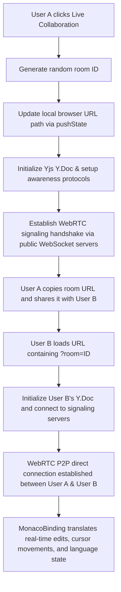

# 🚀 UniCompile - Universal Online Compiler

UniCompile is a premium, high-performance, and responsive multi-language online compiler. Built with **Next.js 16**, **Monaco Editor**, and **WebAssembly**, it provides a professional-grade development environment that works both online and offline.

## ✨ Key Features

-   **🌐 Multi-Language Support**: Compile and run code in C, C++, Python, Java, C#, Go, Rust, PHP, JavaScript, and TypeScript.
-   **📶 Offline-First**: 
    -   Works as a **PWA** (Progressive Web App) - installable on iOS, Android, and Desktop.
    -   **Local Execution**: Uses **WebAssembly (Pyodide)** to run Python and JavaScript locally in the browser when offline.
-   **🐙 GitHub Integration**:
    -   **Sign in with GitHub**: Secure authentication via NextAuth.
    -   **Save to Gist**: Instantly export your code snippets to your GitHub Gists.
    -   **Share via URL**: Share your code with a unique, base64-encoded URL.
-   **🎨 Premium Aesthetic**:
    -   **Glassmorphic Design**: Modern dark mode with blurred surfaces and vibrant accents.
    -   **Fully Responsive**: Optimized for every screen size from 4-inch phones to large monitors.
-   **⚙️ Pro Editor Settings**:
    -   Customizable **Font Size** (12px - 24px).
    -   Multiple **Themes** (Pro Dark, High Contrast, Light Mode).
    -   **Minimap** toggle for better navigation.

## 🛠️ Technology Stack

UniCompile is built on a modern, high-performance web development stack leveraging real-time collaboration and offline execution engines:

| Technology | Badge & Version | Purpose |
| :--- | :--- | :--- |
| **Next.js** | [](https://nextjs.org/) | React Meta-Framework (App Router) |
| **React** | [](https://react.dev/) | UI library (React 19 support) |
| **TypeScript** | [](https://www.typescriptlang.org/) | Strict static typing and code reliability |
| **Monaco Editor** | [](https://github.com/suren-atoyan/monaco-react) | High-performance in-browser code editor |
| **Yjs** | [](https://yjs.dev/) | CRDT library for collaborative real-time editing |
| **y-webrtc** | [](https://github.com/yjs/y-webrtc) | WebRTC signaling and mesh network replication |
| **y-monaco** | [](https://github.com/yjs/y-monaco) | Binding layer connecting Yjs shared text to Monaco |
| **NextAuth.js** | [](https://next-auth.js.org/) | User authentication (GitHub OAuth) |
| **Framer Motion** | [](https://www.framer.com/motion/) | Smooth animations and micro-interactions |
| **Lucide React** | [](https://lucide.dev/) | Modern and clean iconography |
| **Netlify** | [](https://www.netlify.com/) | Deployment and serverless hosting infrastructure |

---

## 📂 Project Structure

Below is the complete project directory tree layout with annotations:

```text
UniCompile/
├── app/
│   ├── api/
│   │   ├── auth/
│   │   │   └── [...nextauth]/
│   │   │       └── route.ts         # GitHub OAuth NextAuth handlers
│   │   └── github/
│   │       └── gist/
│   │           └── route.ts         # GitHub Gist export API endpoint
│   ├── favicon.ico                  # Application icon
│   ├── globals.css                  # Global styles & glassmorphism system tokens
│   ├── layout.tsx                   # Core HTML frame & Context/Session providers
│   ├── page.module.css              # Styling specific to the main page layout
│   └── page.tsx                     # Primary layout, router state, and Yjs initiator
├── components/
│   ├── Editor.tsx                   # Monaco Editor wrapper component
│   ├── Navbar.module.css            # Styles for Navbar components (dark mode / glass)
│   ├── Navbar.tsx                   # Top navigation bar (run, share, settings, collaborate)
│   ├── OutputPane.module.css        # Output panel console terminal styles
│   ├── OutputPane.tsx               # Code execution output/stderr display terminal
│   ├── Providers.tsx                # NextAuth SessionProvider wrapper
│   ├── SettingsModal.module.css     # Settings popup layout styling
│   └── SettingsModal.tsx            # Editor custom config panel UI (Font size, theme, etc.)
├── lib/
│   ├── execution.ts                 # Wandbox compiler API backend execution runner
│   └── localExecution.ts            # Pyodide (WASM) & JS offline sandbox execution runners
├── public/
│   ├── logo.svg                     # Application branding vector logo
│   └── manifest.json                # PWA config (iOS, Android, and Desktop setup)
├── .env.example                     # Sample environment variable template
├── .env.local                       # Local developer secrets (ignored by Git)
├── eslint.config.mjs                # Linting configuration rules
├── next-env.d.ts                    # Next.js custom TypeScript declarations
├── next.config.ts                   # Webpack and framework config (e.g. Next-PWA setup)
├── package.json                     # Scripts, metadata, and active dependency list
├── package-lock.json                # Hardened lockfile mapping dependency tree
├── tsconfig.json                    # Compiler settings config for TypeScript
└── netlify.toml                     # Netlify CI/CD build configuration
```

---

## 🔄 Flow Diagrams

Here are the system flow diagrams outlining execution paths and real-time collaboration:

### 1. Code Execution Flow (Online vs. Offline)
```mermaid
graph TD
    A[User enters code & clicks Run] --> B{Is language run locally?}
    B -->|Yes (JS / TS / Python)| C{Is device offline?}
    C -->|Yes| D[Execute inside browser sandbox via WASM / WebWorkers]
    C -->|No| D
    B -->|No (C, C++, Rust, Go, etc.)| E{Is device online?}
    E -->|Yes| F[Send compilation payload to Wandbox API Server]
    E -->|No| G[Display offline warning toast notification]
    D --> H[Display output stdout/stderr in OutputPane]
    F --> H
```

### 2. Live Session Collaboration Flow


## 🚀 Getting Started

### Prerequisites
-   Node.js 18+ 
-   NPM or Yarn

### Installation
1.  Clone the repository:
    ```bash
    git clone https://github.com/ajf013/UniCompile.git
    cd UniCompile
    ```
2.  Install dependencies:
    ```bash
    npm install
    ```
3.  Set up environment variables in `.env.local`:
    ```env
    GITHUB_ID=your_id
    GITHUB_SECRET=your_secret
    NEXTAUTH_SECRET=your_random_secret
    NEXTAUTH_URL=http://localhost:3000
    ```
4.  Run the development server:
    ```bash
    npm run dev
    ```

## 🌐 Deployment

The project is configured for **Netlify**. 
-   The `netlify.toml` handles the build settings automatically.
-   Make sure to set the Environment Variables in the Netlify Dashboard.
-   Custom Domain: Set your `NEXTAUTH_URL` to your production domain (e.g., `https://compile.fcruz.org`).

---
Built with ❤️ by [ajf013](https://github.com/ajf013)
