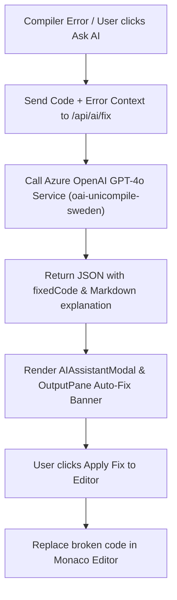

# 🚀 UniCompile - Universal Online Compiler (v0.3.0)

UniCompile is a premium, high-performance, and responsive multi-language online compiler & AI IDE. Built with **Next.js 16**, **Azure OpenAI (GPT-4o)**, **Monaco Editor**, and **WebAssembly**, it provides a professional-grade development environment that works both online and offline across Windows, macOS, iOS (iPhone/iPad), and Android devices.

---

## 🤖 Azure AI Integration (v0.3.0)

UniCompile is backed by dedicated Azure OpenAI resources deployed under Azure Subscription `6556862d-2bee-43e2-bd37-4493ea5c1c70`:

- **Resource Group**: `rg-unicompile-ai`
- **Azure OpenAI Service**: `oai-unicompile-sweden` (`swedencentral`)
- **Deployed Model**: `gpt-4o` (`GlobalStandard` SKU)
- **Endpoint**: `https://oai-unicompile-sweden.openai.azure.com/`

### AI Capabilities
1. **✨ 1-Click Auto-Fix & Explain**:
   - Automatically detects compiler or runtime errors.
   - Click **"✨ Auto-Fix & Explain with AI"** to receive fixed code and a step-by-step diagnostic breakdown.
   - Click **"Apply Fix to Editor"** to immediately update your code in Monaco Editor.
2. **🧠 Code Complexity & AI Assistant**:
   - Analyze time and space complexity (e.g., $O(N \log N)$ Time, $O(1)$ Space).
   - Get automated code refactoring and security suggestions.
3. **⚡ AI Inline Completion Engine**:
   - Real-time inline code completion via `/api/ai/complete`.

---

## ✨ Core Key Features

- **🌐 Multi-Language Support**: C, C++, Python, Java, C#, Go, Rust, PHP, JavaScript, and TypeScript.
- **🌓 Dark, Light & High Contrast Themes**: Seamless theme toggle with Monaco editor synchronization.
- **📥 Interactive STDIN & Execution Stats**: Custom STDIN input stream, execution duration (ms), memory, and exit code badges.
- **📚 Code Templates & Algorithm Library**: Pre-loaded algorithm and starter snippets.
- **📑 Multi-File Editor Tabs**: Manage multiple file drafts simultaneously.
- **💾 Code Export & File Downloader**: Download source files with proper extensions (`.py`, `.cpp`, `.cs`, `.java`, etc.).
- **⌨️ Global Keyboard Shortcuts**:
  - <kbd>⌘/Ctrl</kbd> + <kbd>Enter</kbd>: Compile & Run Code
  - <kbd>⌘/Ctrl</kbd> + <kbd>Shift</kbd> + <kbd>F</kbd>: Format Code
  - <kbd>⌘/Ctrl</kbd> + <kbd>S</kbd>: Download File
  - <kbd>⌘/Ctrl</kbd> + <kbd>Shift</kbd> + <kbd>L</kbd>: Templates Library
  - <kbd>⌘/Ctrl</kbd> + <kbd>/</kbd>: Shortcuts Help Sheet
- **📶 Offline-First & Auto-Cache Update**:
  - **PWA** with immediate Service Worker activation (`skipWaiting: true`) and cache-invalidation headers for instant updates across Windows, iOS, and Mac.
  - **WebAssembly (Pyodide)** for offline Python & JavaScript execution.
- **👥 Real-Time WebRTC Collaboration**: Live multi-user peer-to-peer coding sessions using Yjs and WebRTC.

---

## 🛠️ Technology Stack

| Technology | Badge & Version | Purpose |
| :--- | :--- | :--- |
| **Azure OpenAI** | [](https://azure.microsoft.com/en-us/products/ai-services/openai-service) | AI Auto-Fix, Code Analysis & Completion |
| **Next.js** | [](https://nextjs.org/) | React Framework (App Router) |
| **React** | [](https://react.dev/) | UI library (React 19) |
| **TypeScript** | [](https://www.typescriptlang.org/) | Strict static typing and code reliability |
| **Monaco Editor** | [](https://github.com/suren-atoyan/monaco-react) | In-browser code editor |
| **Yjs & WebRTC** | [](https://yjs.dev/) | Real-time CRDT collaboration |
| **Lucide React** | [](https://lucide.dev/) | Iconography system |

---

## 📂 Project Structure

```text
UniCompile/
├── app/
│   ├── api/
│   │   ├── ai/
│   │   │   ├── complete/route.ts          # AI inline completion endpoint
│   │   │   ├── explain/route.ts           # AI code analysis & complexity endpoint
│   │   │   └── fix/route.ts               # AI auto-fix & error diagnostic endpoint
│   │   ├── auth/[...nextauth]/route.ts    # GitHub OAuth NextAuth handlers
│   │   └── github/gist/route.ts           # GitHub Gist export API endpoint
│   ├── favicon.ico                        # Application icon
│   ├── globals.css                        # Dark, Light, & High Contrast design tokens
│   ├── layout.tsx                         # HTML frame, PWA cache invalidation headers
│   └── page.tsx                           # Primary application page & router state
├── components/
│   ├── AIAssistantModal.tsx               # Azure AI assistant & code auto-fix dialog
│   ├── AIAssistantModal.module.css        # AIAssistantModal styles
│   ├── Editor.tsx                         # Monaco Editor wrapper component
│   ├── EditorTabs.tsx                     # Multi-file tab navigation bar
│   ├── Navbar.tsx                         # Header with Run, Ask AI, Templates, Download, Theme
│   ├── OutputPane.tsx                     # Terminal output, STDIN input, & AI Auto-Fix button
│   ├── ShortcutsModal.tsx                 # Keyboard shortcuts cheat sheet modal
│   ├── SnippetsModal.tsx                  # Templates & algorithm library drawer
│   └── SettingsModal.tsx                  # Editor custom settings panel
├── lib/
│   ├── ai.ts                              # Azure OpenAI API client helper
│   ├── execution.ts                       # Wandbox API execution engine
│   ├── localExecution.ts                  # Pyodide (WASM) & JS offline runner
│   └── snippets.ts                        # Pre-loaded algorithm and starter snippets
├── public/
│   ├── manifest.json                      # PWA manifest
│   └── sw.js                              # Service Worker with immediate cache activation
├── next.config.ts                         # Next-PWA setup with skipWaiting: true
└── package.json                           # v0.3.0 application manifest
```

---

## 🔄 Flow Diagrams

### Azure AI Error Fix & Code Assistant Flow

```mermaid
graph TD
    A["Compiler Error / User clicks Ask AI"] --> B["Send Code + Error Context to /api/ai/fix"]
    B --> C["Call Azure OpenAI GPT-4o Service (oai-unicompile-sweden)"]
    C --> D["Return JSON with fixedCode & Markdown explanation"]
    D --> E["Render AIAssistantModal & OutputPane Auto-Fix Banner"]
    E --> F["User clicks Apply Fix to Editor"]
    F --> G["Replace broken code in Monaco Editor"]
```

---

## 🚀 Getting Started

### Installation
1. Clone the repository:
   ```bash
   git clone https://github.com/ajf013/UniCompile.git
   cd UniCompile
   ```
2. Install dependencies:
   ```bash
   npm install
   ```
3. Run the development server:
   ```bash
   npm run dev
   ```

---
Built with ❤️ by [ajf013](https://github.com/ajf013)
